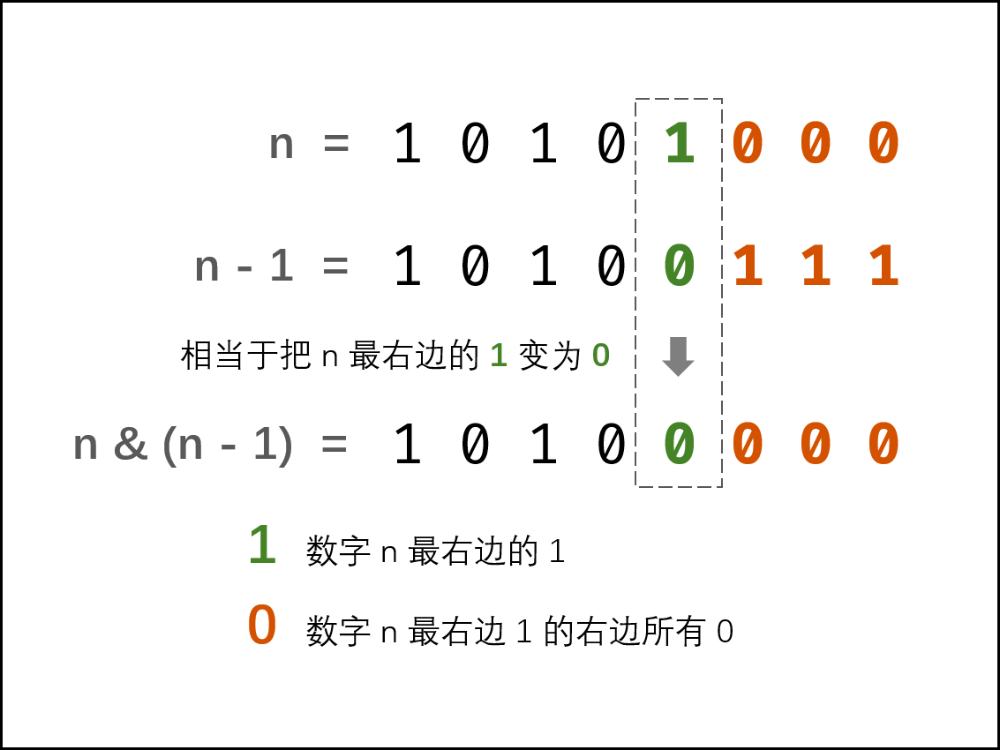

# 剑指 Offer 15. 二进制中1的个数

```text
编写一个函数，输入是一个无符号整数（以二进制串的形式），返回其二进制表达式中数字位数为 '1' 的个数（也被称为 汉明重量).）。

提示：
- 请注意，在某些语言（如 Java）中，没有无符号整数类型。在这种情况下，输入和输出都将被指定为有符号整数类型，并且不应影响您的实现，因为无论整数是有符号的还是无符号的，其内部的二进制表示形式都是相同的。
- 在 Java 中，编译器使用 二进制补码 记法来表示有符号整数。因此，在上面的 示例 3 中，输入表示有符号整数 -3。
```

**示例1：**

```text
输入：n = 11 (控制台输入 00000000000000000000000000001011)
输出：3
解释：输入的二进制串 00000000000000000000000000001011 中，共有三位为 '1'。
```

**示例2：**

```text
输入：n = 128 (控制台输入 00000000000000000000000010000000)
输出：1
解释：输入的二进制串 00000000000000000000000010000000 中，共有一位为 '1'。
```

```java
public class Solution {
    /**
     * 方法一：循环检查二进制位
     * 直接循环检查给定整数 n 的二进制位的每一位是否为 1。
     * 具体代码中，当检查第 i 位时，我们可以让 n 与 2^i进行与运算，当且仅当 n 的第 i 位为 1 时，运算结果不为 0。
     */
    public int hammingWeight(int n) {
        int result = 0;
        for (int i = 0; i < 32; i++) {
            //<<是位移运算服， <<左移运算，>>右移运算，还有不带符号的位移运算 >>>.
            //左移的运算规则：按二进制形式把所有的数字向左移动对应的位数，高位移出（舍弃），低位的空位补零。
            //1<<i 将1左移i位
            if ((n & (1 << i)) != 0) {
                result++;
            }
        }
        return result;
    }
}
```



```java
public class Solution {
    //方法二：巧用 n & n - 1，
    //每一次运算都会把最右边的 1 置为 0 ，不断循环，直到 n 为 0 
    public int hammingWeight(int n) {
        int res = 0;
        while (n != 0) {
            res++;
            n &= n - 1;
        }
        return res;
    }
}
```