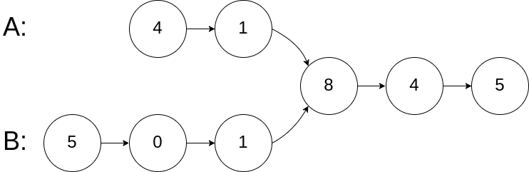

# 剑指 Offer 52. 两个链表的第一个公共节点

```text
输入两个链表，找出它们的第一个公共节点。
```

**示例1：**


```text
输入：intersectVal = 8, listA = [4,1,8,4,5], listB = [5,0,1,8,4,5], skipA = 2, skipB = 3
输出：Reference of the node with value = 8
输入解释：相交节点的值为 8 （注意，如果两个列表相交则不能为 0）。从各自的表头开始算起，链表 A 为 [4,1,8,4,5]，链表 B 为 [5,0,1,8,4,5]。在 A 中，相交节点前有 2 个节点；在 B 中，相交节点前有 3 个节点。
```

```java
/**
 * Definition for singly-linked list.
 * public class ListNode {
 *     int val;
 *     ListNode next;
 *     ListNode(int x) {
 *         val = x;
 *         next = null;
 *     }
 * }
 */
public class Solution {
    public ListNode getIntersectionNode(ListNode headA, ListNode headB) {
        //浪漫的双指针方法，a，b先分别遍历自己的，遍历完后再去遍历对面的，如果有相同的，自会相遇
        //方法二：运用哈希表，有相同的则加不进去，则可以返回，但是很浪费时间空间，不是很建议
        ListNode a = headA, b = headB;
        while (a != b) {
            a = a != null ? a.next : headB;
            b = b != null ? b.next : headA;
        }
        return a;
    }
}
```

```java
import java.util.HashSet;
import java.util.Set;

//Definition for singly-linked list.
public class ListNode {
    int val;
    ListNode next;

    ListNode(int x) {
        val = x;
        next = null;
    }
}

public class Solution {
    public ListNode getIntersectionNode(ListNode headA, ListNode headB) {
        //方法二：运用哈希表，有相同的则加不进去，则可以返回，但是很浪费时间空间，不是很建议
        //因为要地址也相同，所以把 ListNode 传进去
        Set<ListNode> dic = new HashSet<>();
        while (headA != null) {
            dic.add(headA);
            headA = headA.next;
        }
        while (headB != null) {
            //Java 集合类中的 Set.contains() 方法判断 Set 集合是否包含指定的对象。该方法返回值为 boolean 类型，如果 Set 集合包含指定的对象，则返回 true，否则返回 false。
            if (dic.contains(headB)) {
                break;
            }
            headB = headB.next;
        }
        return headB;
    }
}
```