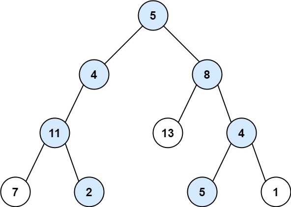

# 剑指 Offer 34. 二叉树中和为某一值的路径

```text
给你二叉树的根节点 root 和一个整数目标和 targetSum ，找出所有 从根节点到叶子节点 路径总和等于给定目标和的路径。

叶子节点 是指没有子节点的节点。
```

**示例1：**


```text
输入：root = [5,4,8,11,null,13,4,7,2,null,null,5,1], targetSum = 22
输出：[[5,4,11,2],[5,8,4,5]]
```

**示例2：**


```text
输入：root = [1,2,3], targetSum = 5
输出：[]
```

```java
/**
 * Definition for a binary tree node.
 * public class TreeNode {
 *     int val;
 *     TreeNode left;
 *     TreeNode right;
 *     TreeNode() {}
 *     TreeNode(int val) { this.val = val; }
 *     TreeNode(int val, TreeNode left, TreeNode right) {
 *         this.val = val;
 *         this.left = left;
 *         this.right = right;
 *     }
 * }
 */
class Solution {
    //找到所有满足从「根节点」到某个「叶子节点」经过的路径上的节点之和等于目标和的路径。核心思想是对树进行一次遍历，在遍历时记录
    // 从根节点到当前节点的路径和，以防止重复计算。
    List<List<Integer>> ret = new LinkedList<List<Integer>>();
    //Deque 双端队列
    Deque<Integer> path = new LinkedList<Integer>();

    public List<List<Integer>> pathSum(TreeNode root, int target) {
        //方法一：深度优先搜索
        //我们可以采用深度优先搜索的方式，枚举每一条从根节点到叶子节点的路径。当我们遍历到叶子节点，且此时路径和恰为目标和时，我们就找到了一条满足条件的路径。
        dfs(root, target);
        return ret;
    }

    public void dfs(TreeNode root, int target) {
        if (root == null) return;
        //java.util.LinkedList.offerLast(E e) 将指定的元素插入LinkedList的末尾。
        path.offerLast(root.val);
        target -= root.val;
        if (root.left == null && root.right == null && target == 0) {
            ret.add(new LinkedList<Integer>(path));
        }
        dfs(root.left, target);
        dfs(root.right, target);
        //pollLast()返回列表的最后一个元素并从列表中移除
        path.pollLast();
    }
}
```