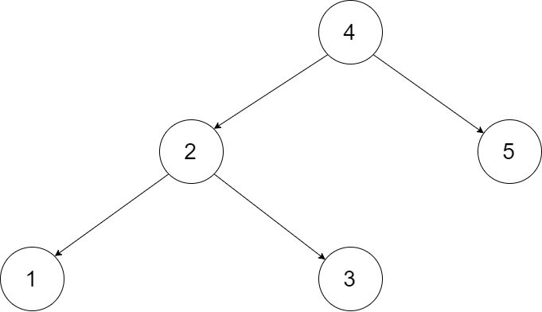
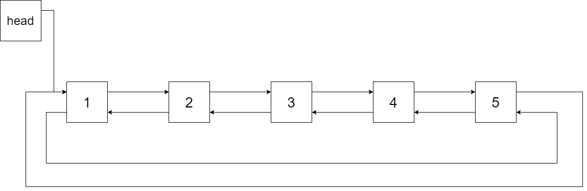

# 剑指 Offer 36. 二叉搜索树与双向链表

```text
输入一棵二叉搜索树，将该二叉搜索树转换成一个排序的循环双向链表。要求不能创建任何新的节点，只能调整树中节点指针的指向。

为了让您更好地理解问题，以下面的二叉搜索树为例：
```



```text
我们希望将这个二叉搜索树转化为双向循环链表。链表中的每个节点都有一个前驱和后继指针。对于双向循环链表，第一个节点的前驱是最后一个节点，最后一个节点的后继是第一个节点。

下图展示了上面的二叉搜索树转化成的链表。“head” 表示指向链表中有最小元素的节点。
```



```text
特别地，我们希望可以就地完成转换操作。当转化完成以后，树中节点的左指针需要指向前驱，树中节点的右指针需要指向后继。还需要返回链表中的第一个节点的指针。
```

```java
/*
// Definition for a Node.
class Node {
    public int val;
    public Node left;
    public Node right;

    public Node() {}

    public Node(int _val) {
        val = _val;
    }

    public Node(int _val,Node _left,Node _right) {
        val = _val;
        left = _left;
        right = _right;
    }
};
*/
class Solution {
    //二叉搜索树的中序遍历为 递增序列 。
    Node head, pre;

    public Node treeToDoublyList(Node root) {
        if (root == null) return null;
        dfs(root);
        //进行头节点和尾节点的相互指向，这两句的顺序也是可以颠倒的
        pre.right = head;
        head.left = pre;

        return head;
    }

    public void dfs(Node cur) {
        //中序遍历 左 头 右
        // dfs(root.left);  左
        // System.out.println(root.val);  根
        // dfs(root.right);  右
        if (cur == null) return;
        dfs(cur.left);

        //pre用于记录双向链表中位于cur左侧的节点，即上一次迭代中的cur,当pre==null时，cur左侧没有节点,即此时cur为双向链表中的头节点
        if (pre == null) head = cur;
            //反之，pre!=null时，cur左侧存在节点pre，需要进行pre.right=cur的操作。
        else pre.right = cur;
        //pre是否为null对这句没有影响,且这句放在上面两句if else之前也是可以的。
        cur.left = pre;
        //pre指向当前的cur
        pre = cur;
        //全部迭代完成后，pre指向双向链表中的尾节点
        dfs(cur.right);
    }
}
```