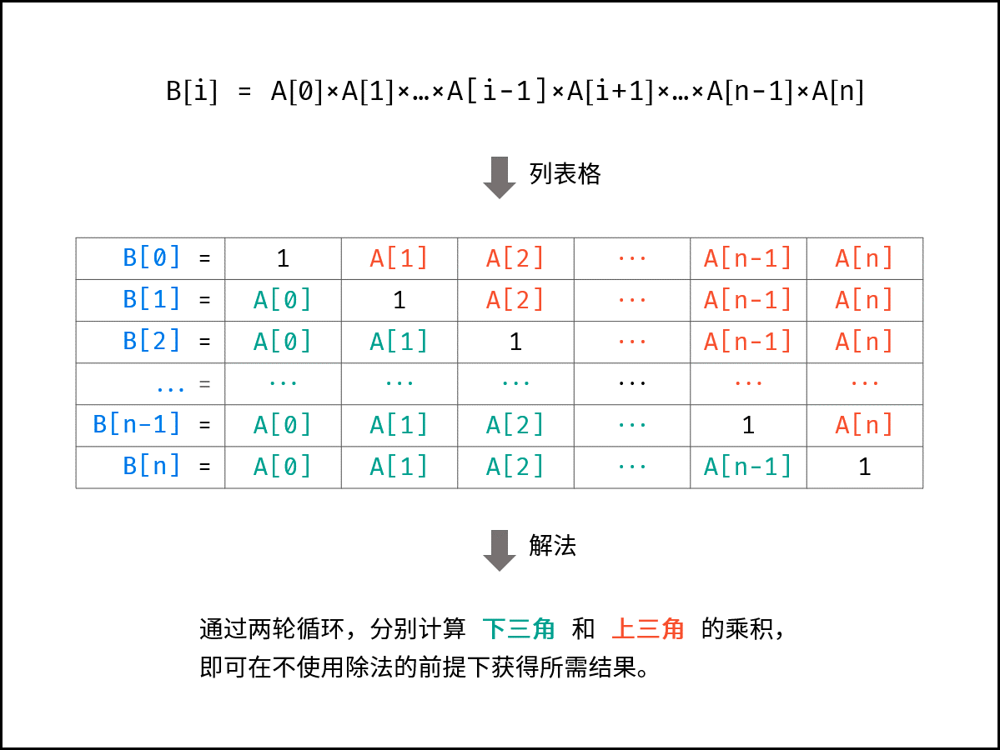

# 剑指 Offer 66. 构建乘积数组

```text
给定一个数组 A[0,1,…,n-1]，请构建一个数组 B[0,1,…,n-1]，其中 B[i] 的值是数组 A 中除了下标 i 以外的元素的积, 即 B[i]=A[0]×A[1]×…×A[i-1]×A[i+1]×…×A[n-1]。不能使用除法。
```

**示例1：**

```text
输入: [1,2,3,4,5]
输出: [120,60,40,30,24]
```

**根据表格的主对角线（全为 11 ），可将表格分为 上三角 和 下三角 两部分。分别迭代计算下三角和上三角两部分的乘积，即可 不使用除法 就获得结果。**


```java
class Solution {
    public int[] constructArr(int[] a) {
        int len = a.length;
        //初始化：数组 B ，其中 B[0] = 1 ；辅助变量 tmp = 1 ；
        if (len == 0) return new int[0];
        int[] b = new int[len];
        b[0] = 1;
        int tmp = 1;
        //计算 B[i] 的 下三角 各元素的乘积，直接乘入 B[i]B[i] ；
        for (int i = 1; i < len; i++) {
            b[i] = b[i - 1] * a[i - 1];
        }
        //计算 B[i] 的 上三角 各元素的乘积，记为 tmp ，并乘入 B[i] ；
        for (int i = len - 2; i >= 0; i--) {
            tmp *= a[i + 1];
            b[i] *= tmp;
        }
        return b;
    }
}
```